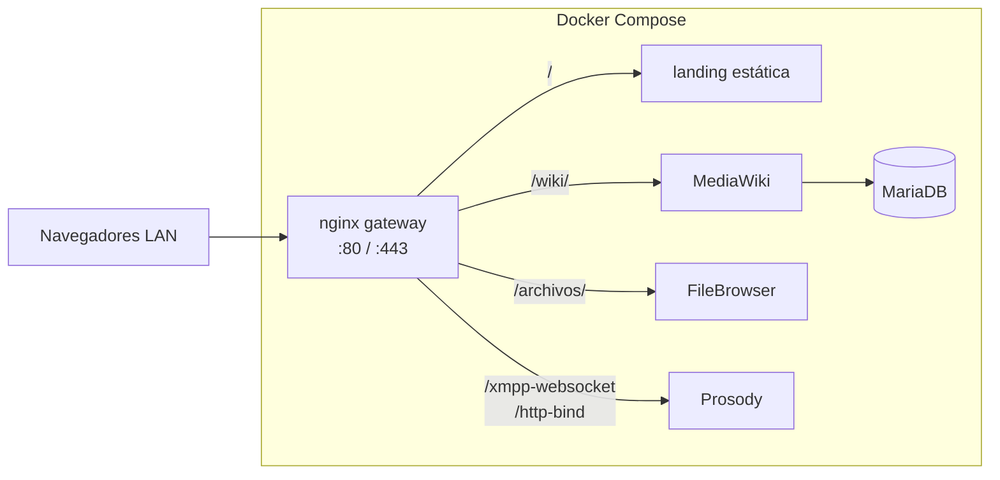

# Arquitectura

## Visión general

Pimienta Negra es un **stack Docker Compose** pensado para una LAN (típicamente una Raspberry Pi u otra máquina siempre encendida). Un **único gateway HTTP(S)** (nginx) expone la wiki, el cliente de chat estático, el portal de archivos y los endpoints XMPP; los servicios internos no se publican todos directamente al host.

Además, **`/chat/`** la sirve el mismo **nginx** desde el volumen `config/converse/` (Converse.js estático); no hay otro contenedor.

## Servicios (contenedores)

| Servicio | Imagen / rol | Puerto host (típico) | Notas |
|----------|--------------|----------------------|--------|
| **gateway** | `nginx:alpine` | `80`, `443` | Reverse proxy; TLS en 443 solo para rutas de chat y XMPP (ver decisiones). |
| **wiki** | `mediawiki` | `8080→80` (atajo) | `LocalSettings.php` + `apache-wiki-path.conf` (Alias `/wiki`); imágenes en `data/mediawiki/images/`. |
| **db** | `mariadb:10.5` | (interno) | Base `my_wiki`; credenciales en compose + `LocalSettings.php`. |
| **filebrowser** | `filebrowser/filebrowser` | `8081→80` (atajo) | Raíz de archivos `./archivos`; DB SQLite en `data/filebrowser/`. |
| **prosody** | `prosodyim/prosody:13.0` | (interno) | XMPP; HTTP WebSocket/BOSH en **5280** hacia nginx. |

## Rutas del gateway (nginx)

| Ruta | Destino |
|------|---------|
| `/` | Landing estática (`config/landing/`, vía volumen en el gateway). |
| `/config.json`, `/landing.css`, `/assets/…` | Archivos de la landing (sin pasar por MediaWiki). |
| `/wiki/…` | MediaWiki en el contenedor `wiki` (**URI completa** reenviada; Apache resuelve `/wiki` → DocumentRoot). |
| `/favicon.ico`, `/favicon.png` | PNG único del nodo (misma identidad en wiki, chat y pestañas que piden `/favicon.ico`). |
| `/archivos/static/img/icons/` | Mismos archivos que `config/filebrowser/branding/img/icons/` (HEAD/GET; evita limitaciones del upstream FileBrowser). |
| `/archivos/` | FileBrowser (sin strip del prefijo; `baseURL=/archivos`) |
| `/chat/`, `/chat` | En **puerto 80:** **301 → HTTPS** (mismo host y ruta). En **443:** Converse.js estático (`config/converse/`). |
| `/http-bind`, `/xmpp-websocket` | Prosody `:5280` (HTTP plano en red Docker); en 80 y 443 según cómo acceda el cliente. |

**Puerto 443 (TLS):** **`/chat/`** sirve estáticos; **`/http-bind`** y **`/xmpp-websocket`** igual que en 80; el resto de URLs HTTPS se redirige a HTTP para no forzar certificado en wiki y archivos.

## Datos persistentes (volumen / host)

- `data/mediawiki/images/` — subidas de la wiki.  
- `db_data` (volumen Docker) — MariaDB.  
- `data/filebrowser/` — SQLite de FileBrowser (no versionar).  
- `data/prosody/` — datos XMPP.  
- `data/prosody-certs/` — certificados autofirmados (`init-chat.sh`), usados por Prosody y por nginx (443).  
- `./archivos/` — árbol compartido de FileBrowser (contenido comunitario, no suele ir al backup de wiki).

## Resolución de nombres en la LAN

- **`pimienta.local`** (y subdominios de chat/XMPP) en clientes que soportan **mDNS** (Avahi/Bonjour).  
- Script: `proyecto_pimienta/ops/setup-lan-mdns.sh` (servicio systemd recomendado; la IP se recalcula al iniciar el servicio para no quedar obsoleta con DHCP).

## Variables de entorno críticas

Definidas en `proyecto_pimienta/.env` (ver `.env.example`): `MW_SERVER` (opcional; vacío = la wiki usa el host de la petición), `GATEWAY_HTTP_PORT`, `GATEWAY_HTTPS_PORT`, credenciales FileBrowser y Prosody, `LAN_MDNS`, etc. Si `MW_SERVER` está fijado, debe ser **coherente** con la URL que escribe la usuaria (incluido puerto si no es 80).
